Gráficos estadísticos con R
========================================================
author:Rubén Sánchez Sancho 
date: 
autosize: true
transition: rotate


[www.datasciencesexy.wordpress.com](https://datasciencesexy.wordpress.com/)  

Introducción a la función plot
========================================================
type: section

- [Creación de un gráfico básico con títulos](#/id1)
- [Leyenda y configuración de margenes](#/id2)
- [Texto y expresiones matemáticas](#/id3)
- [Símbolos y colores](#/id4)
- [Guardado en varios formatos](#/id5)

Creación de un gráfico básico con títulos
========================================================
id: id1
type: sub-section
source: ./src/01_code01_introducing_draft1.R

En esta sección crearemos nuestro primer gráfico y lo haremos más informativo añadiéndole títulos

* Uso de la función __plot()__ en dos variables
* Determinar que tipo de gráfico necesitamos (puntos/líneas)
* Añadir títulos, subtítulos y etiquetas a los ejes


Slide 0
========================================================
title:false

* paquete __graph__ preinstalado en la distribución de __R__
* utilizaremos para los ejemplos el paquete __BOD__
* para utilizarlo escribimos su nombre en la consola

```r
BOD
```

* para consultar la documentación y ver el conjunto de datos utilizar función __View()__ (la primera letra en mayúscula)


```r
?BOD
```


Slide 1
========================================================
title:false

* la función __plot()__
* por defecto dibuja un _diagrama de dispersión_ con __puntos__


```r
plot(demand ~ Time, data = BOD)
```

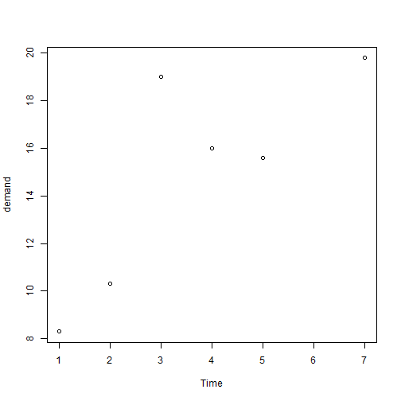

Slide 2
========================================================
title:false


```r
plot(demand ~ Time, data = BOD, type = "l")
```


***


```r
plot(demand ~ Time, data = BOD, type = "b")
```

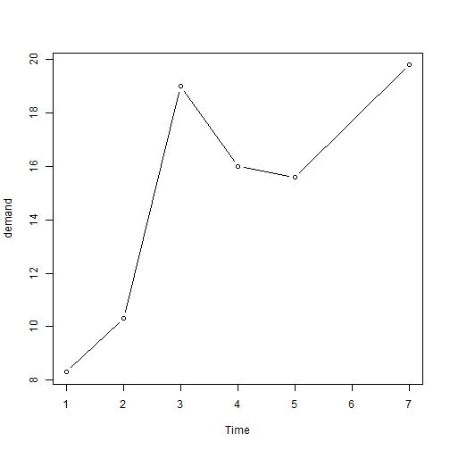

Slide 3
========================================================
title:false

*existen 8 diferentes tipo de gráfico (argumento __type__)


```r
?plot
```

Slide 4
========================================================
title:false

*para la inclusión de un título pasamos una cadena al argumento __main__


```r
plot(demand ~ Time, type = "l", data = BOD, main="Oxigeno Bioquímico")
```

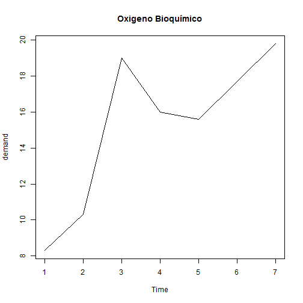

Slide 5
========================================================
title:false

*para la inclusión de un subtitulo (nombre de la figura) pasamos un cadena de caracteres al argumento __sub__


```r
plot(demand ~ Time, data = BOD, main="Oxígeno bioquímico", sub = "Relación entre demand y time")
```

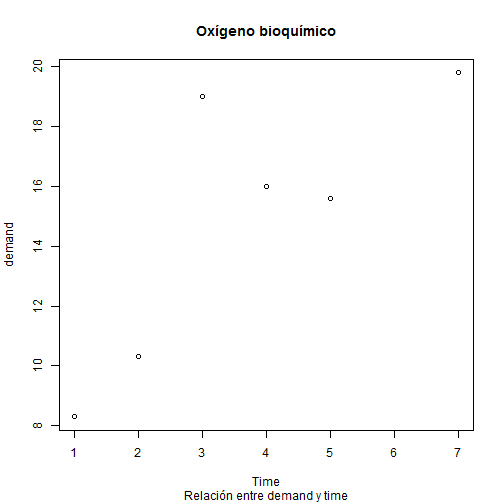

Slide 6
========================================================
title:false

*para la inclusión de títulos a los ejes pasamos una cadena a los argumentos __xlab__ y __ylab__


```r
plot(demand ~ Time, type = "l", data = BOD, main="Biochemical Oxygen", 
 sub = "Relationship between demand and time", xlab = "time in days", ylab = "demand in mg/l")
```

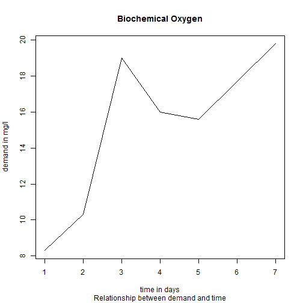


Leyenda y configuración de margenes
========================================================
id: id2
type: sub-section
source: ./src/01_code02_legends_draft1.R

En esta sección haremos el gráfico más informativo y con una mejor apariencia añadiéndole una leyenda y configurando los margenes.

* Uso de la función __legend()__
* Uso de la función __par()__
* Ajuste de los margenes

Slide 7
========================================================
title:false

En esta sección utilizaremos la matriz de datos __VADeaths__


```r
VADeaths
```

como siempre es interesante consultar la documentación


```r
?VADeaths
```


Slide 8
========================================================
title:false

Creamos dos vectores para las dos primeras columnas:


```r
male.deaths <- VADeaths [,1]
female.deaths <- VADeaths [,2]
```

Al estar los datos agrupados por intervalos, crearemos un vector para el eje x que se tratara de una secuencia de las marcas de clase con una amplitud de 5:


```r
x.points = seq(from = 52,to = 72, by = 5)
```


Slide 9
========================================================
title:false

Utilizamos la función __plot__ como vimos en el capítulo anterior:


```r
plot(x.points, male.deaths, type = "b", xlab = "age", ylab = "deaths", pch = "m")
```

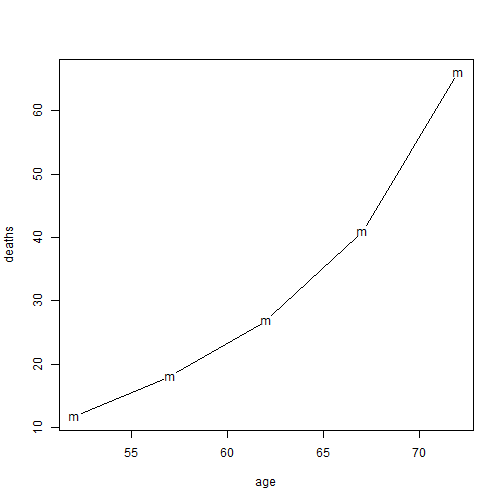


Slide 10
========================================================
title:false


Si queremos añadir una nueva línea al gráfico para otra variable utilizaremos la función __lines__:


```r
lines(x.points, female.deaths, type = "b", pch = "f")
```

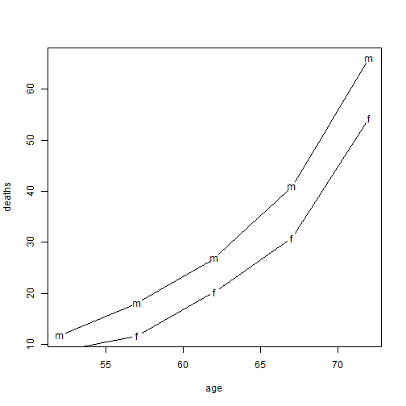

Slide 11
========================================================
title:false

Para añadirle una leyenda al grafico utilizaremos la función __legend__:


```r
plot(x.points, male.deaths, type = "b", xlab = "age", ylab = "deaths", pch = "m")
lines(x.points, female.deaths, type = "b", pch = "f")
legend("topleft", legend=c("male","female"), title = "Rural", pch = c("m", "f"))
```

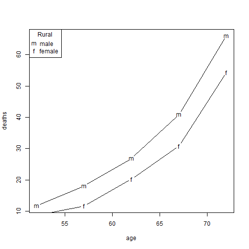


Slide 12
========================================================
title:false


Para ajustar los margenes le pasamos a la función __par__ la función __mar__:


```r
par(mar=c(bottom=0, left=0, top=0, right=0))
plot(x.points, male.deaths, type = "b", xlab = "age", ylab = "deaths", pch = "m")
lines(x.points, female.deaths, type = "b", pch = "f")
legend("topleft", legend=c("male","female"), title = "Rural", pch = 1:2)
```

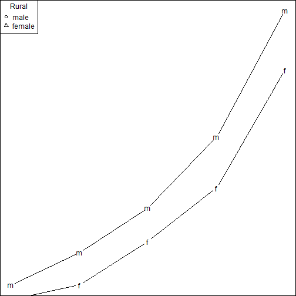


Slide 13
========================================================
title:false


```r
par(mar=c(bottom=4, left=4, top=0.1, right=0.1))
x.points = seq(from = 52,to = 72, by = 5)
plot(x.points, male.deaths, type = "b", pch = "m", xlab = "age", ylab = "deaths")
lines(x.points, female.deaths, type = "b", pch = "f")
```

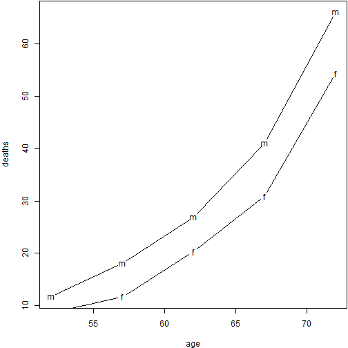


Texto y expresiones matemáticas
========================================================
id: id3
type: sub-section
source: src/01_code03_legends_draft1.R

En esta sección añadiremos al gráfico información, ecuaciones y símbolos

* Uso de la función __text__
* Uso de la función __expresión__
* Ajuste de argumentos o parámetros


Slide 14
========================================================
title:false

Para los ejemplos de esta sección utilizaremos el data frame __women__. Este conjunto de datos muestra la media de altura y pesos de la mujeres americanas de entre 30-39 años.


```r
head(women)
```

```
  height weight
1     58    115
2     59    117
3     60    120
4     61    123
5     62    126
6     63    129
```


Slide 15
========================================================
title:false

Crearemos dos vectores que contendran cada una de las variables:


```r
height = women[,1] 
weight = women[,2]
```


Slide 16
========================================================
title:false

Utilizaremos la función __plot__ como ya hemos echo en entregas anteriores:


```r
plot(height, weight, xlab = "Height", ylab = "Weight") 
```

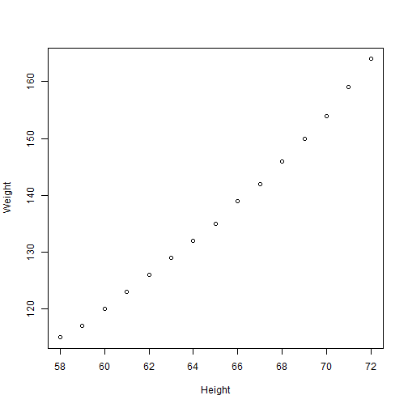

Slide 17
========================================================
title:false

Utilizaremos la función __text__ para añadirle un texto al gráfico:


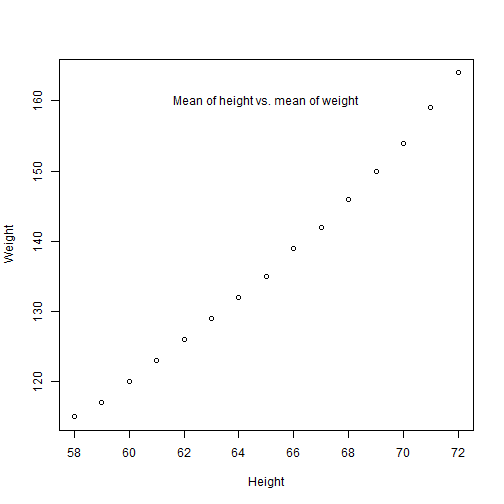

```r
text(65, 160, "Mean of height vs. mean of weight")
```


Slide 18
========================================================
title:false

Utilizamos la función __title__ para añadirle títulos al gráfico:

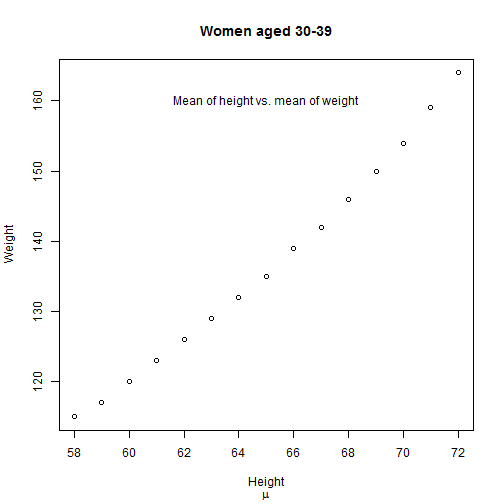


```r
title(main = "Women aged 30-39")
title(sub = expression(mu))
```


Slide 19
========================================================
title:false

Introducimos una expresión matemática en el gráfico:

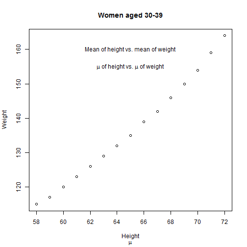


```r
expr = expression(paste(mu, " of height vs. ", mu , " of weight"))
text(65, 155, expr)
```

Slide 19
========================================================
title:false

Introducimos una equación matemática en el gráfico:

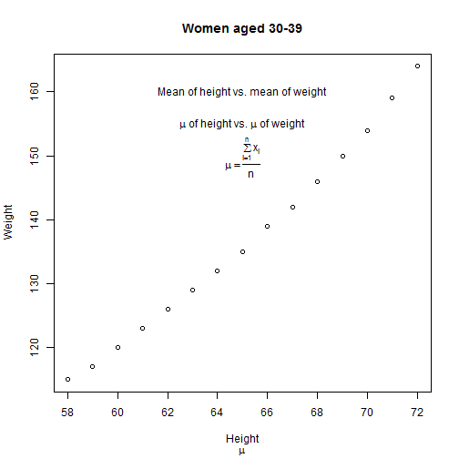


```r
equation = expression(mu == frac(sum(x[i], i==1, n), n) )
text(65, 150, equation)
```


Símbolos y colores
========================================================
id: id4
type: sub-section
source: 01_code04_legends_draft1.R

Guardado en varios formatos
========================================================
id: id5
type: sub-section
source: 01_code05_legends_draft1.R


